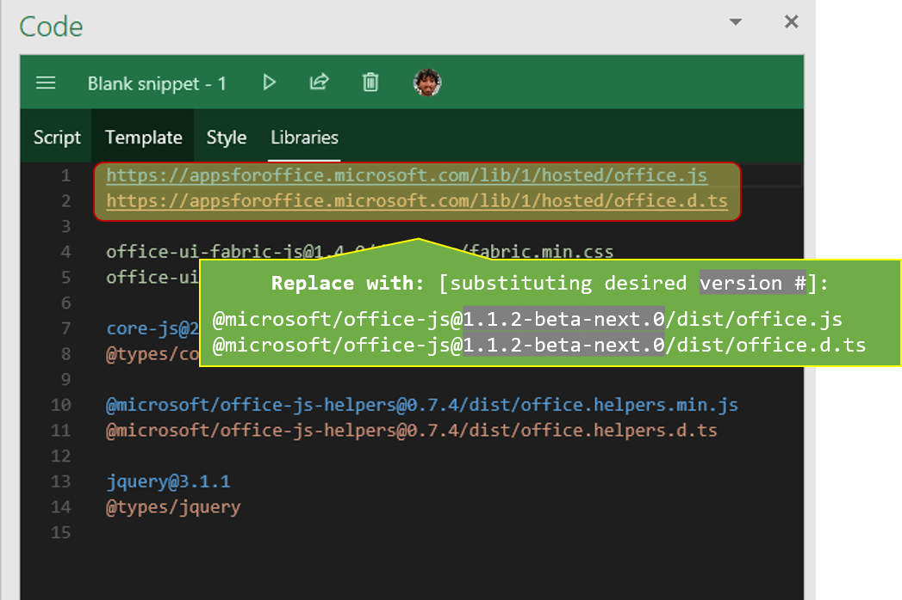

# Office JavaScript APIs

The JavaScript API for Office enables you to create web applications that interact with the object models in Office host applications. Your application will reference the office.js library, which is a script loader. The office.js library loads the object models that are applicable to the Office application that is running the add-in.

The NPM package for Office.js is a copy of what gets published to the official "evergreen" Office.js CDN, at **<https://appsforoffice.microsoft.com/lib/1/hosted/office.js>**.  The NPM also offers alpha and beta versions for faster-cadence beta-testing (relative to the slower-cadence [official BETA endpoint](https://appsforoffice.microsoft.com/lib/beta/hosted/office.js)).

## Installing

To install "office-js" locally via the NPM package, run

    npm install @microsoft/office-js --save

Once installed, the Office.js script reference can be used as

    <src script="node_modules\@microsoft\office-js\dist\office.js"></script>

## IntelliSense definitions

TypeScript definitions for Office.js are available.

* For **latest RELEASE version** of Office.js:
 * DefinitelyTyped: <https://github.com/DefinitelyTyped/DefinitelyTyped/blob/master/types/office-js/index.d.ts>
 * @types: `@types/office-js`.  (Acquire as `npm install @types/office-js --save-dev`)
* For **any version** (**including RELEASE**, but also including ALPHA, BETA, etc.):
  * Inside of the NPM package, under `dist/office.d.ts`
  * In this repo: [dist/office.d.ts](dis/office.d.ts)

Visual Studio 2017+ can use these same TypeScript definitions, even for regular JavaScript.  For JavaScript IntelliSense in earlier versions of Visual Studio, an `office-vsdoc.js` is available alongside the `office.js` file.  As long as you have a `Scripts/_references.js` file in your VS project, and as long as you substitute the existing triple-slash reference (`/// <reference path="https://.../office.js" />`) with the new location (the `-vsdoc` part gets substituted automatically, so use it just as you would in a `

You can see the different versions of the NPM package listed in the dropdown on the top right at <https://unpkg.com/@microsoft/office-js/>.  This provides the alpha and beta versions as well.

To view the latest version numbers for each of the tags, you can also run the following command on the command-line:

    npm view @microsoft/office-js dist-tags --json

When you have a version number, can use it as follows with <https://unpkg.com>: (appending `@<version-#>` right after `office-js`; e.g., `.../office-js@1.1.2-alpha.0/dist/...`

    <src script="https://unpkg.com/@microsoft/office-js@1.1.2-alpha.0/dist/office.js"></script>

## Production vs. Beta vs. Alpha versions

Office.js versioning is described in detail in <https://dev.office.com/docs/add-ins/develop/office-js-versioning>.  Importantly, there is a large difference between what is in the JS files, versus what are the capabilities of a particular computer (i.e., older or slower-to-update versions of office). 

The NPM package and the repo branches assume the following structure.

| GitHub branch name | NPM tag name | Description   | Corresponding CDN location |
| ------------------ |--------------|---------------|----------------------------|
| `release` | `release` (and also `latest`, [a default NPM tag](https://docs.npmjs.com/getting-started/using-tags) | The latest of the released publicly-available APIs | [https://appsforoffice. microsoft.com/lib/ 1/hosted/office.js](https://appsforoffice.microsoft.com/lib/1/hosted/office.js) |
| `beta`   | `beta` |  Forthcoming APIs, not necessarily ready for public consumption yet (and may still change...), but likely available on [Insider Fast (and maybe Insider Slow) builds](https://products.office.com/office-insider) | [https://appsforoffice. microsoft.com/lib/ beta/hosted/office.js](https://appsforoffice.microsoft.com/lib/beta/hosted/office.js)
| `release-next` | `release-next` | A forthcoming update the the "release" branch (typically a couple weeks ahead of "release") | N/A |
| `beta-next` | `beta-next` | A forthcoming update the the "beta" branch (typically a couple weeks ahead of "beta") | N/A |
| `private` | `private` | Any flavor of a release, but deployed for a very specific need (e.g., try out something experimental) or for a specific partner. Unlike the other tags, successive versions of this tag are not necessarily cumulative updates; it is possible to have a `1.1.2-private.1` that has the beta JS, and then a `1.1.2-private.2` that only contains the publicly-available release APIs (with maybe some tweaks) | N/A |

## Using a Private or Beta version with [Script Lab](https://aka.ms/script-lab)

To use a version of the NPM package with [Script Lab](https://aka.ms/script-lab), substitute the CDN reference and the `@types/office-js` reference with the NPM package name and version.  [Note: Script Lab uses <https://unpkg.com> for resolving the package names, so it's very similar guidance as above].

For example, to use a `1.1.2-beta-next.0` version, use the following references:

    @microsoft/office-js@1.1.2-beta-next.0/dist/office.js
    @microsoft/office-js@1.1.2-beta-next.0/dist/office.d.ts

## More info

For more information on Office Add-ins and the Office JavaScript APIs, see:

- [Office Add-ins platform overview](https://dev.office.com/docs/add-ins/overview/office-add-ins)
- [JavaScript API for Office reference](https://dev.office.com/reference/add-ins/javascript-api-for-office)
